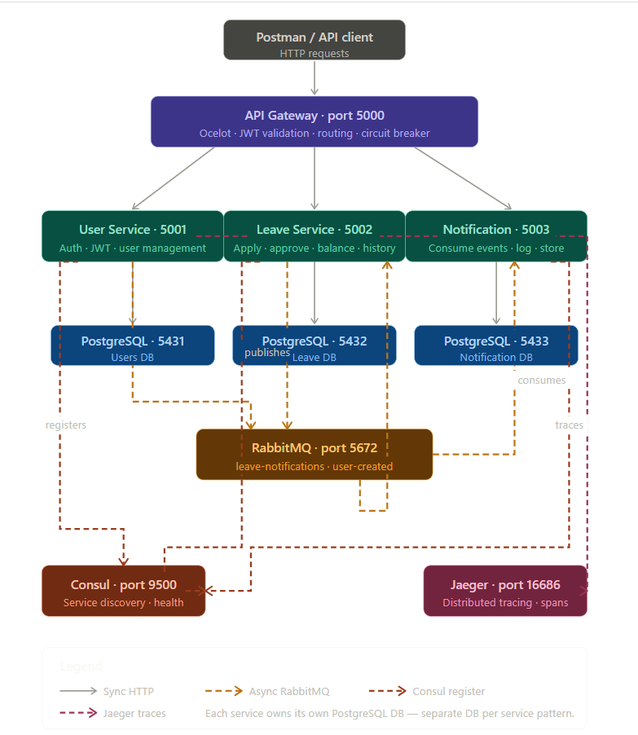

# Microservices Design Document
## Leave Management System

---

## 1. Overview

The Leave Management System is a backend microservices application that allows employees 
to apply for leaves and managers to approve or reject them. The system is built using 
.NET 10.

---

## 2. Architecture Diagram

---

## Tech Stack
- **Runtime**: .NET 10 / C#
- **API Gateway**: Ocelot
- **Service Discovery**: Consul
- **Message Broker**: RabbitMQ
- **Database**: PostgreSQL with Entity Framework Core
- **Authentication**: JWT Bearer tokens
- **Distributed Tracing**: OpenTelemetry + Jaeger
- **Containerization**: Docker + Docker Compose

## 3. Services

### 3.1 API Gateway (Port 5000)
**Technology:** Ocelot (.NET 10)

**Responsibilities:**
- Single entry point for all client requests
- JWT token validation before forwarding requests
- Request routing to downstream services
- Circuit breaker per route (3 failures → 30s break)
- Service discovery via Consul

**Routes:**
| Upstream | Downstream Service |

| /api/auth/* | User Service |
| /api/leave/* | Leave Service |
| /api/notification/* | Notification Service |

---

### 3.2 User Service (Port 5001)
**Technology:** .NET 10 Web API + PostgreSQL (port 5431)

**Responsibilities:**
- User registration and management
- Login and JWT token generation
- Role-based access (Employee / Manager)
- Expose user information to other services

**Database Tables:**
- `Users` — Id, FullName, Email, PasswordHash, Role, ManagerId, CreatedAt

**Key Design Decisions:**
- Passwords hashed using BCrypt — never stored in plain text
- JWT tokens contain userId, role, email, fullName as claims
- Token expiry set to 8 hours
- Email uniqueness enforced at database level

## Pre-seeded Users
| Name | Email | Password | Role |

| Manas | manas@company.com | NAGP2026 | Manager |
| Binil | binil@company.com | NAGP2026 | Employee |
| Rohit | rohit@company.com | NAGP2026 | Employee |

---

### 3.3 Leave Service (Port 5002)
**Technology:** .NET 10 Web API + PostgreSQL (port 5432)

**Responsibilities:**
- Leave balance management per employee per year
- Leave application with full validation
- Manager approval and rejection workflow
- Leave history with pagination and filtering
- Publishes events to RabbitMQ on approval/rejection
- Consumes UserCreated events to initialize leave balance

**Database Tables:**
- `LeaveRequests` — Id, EmployeeId, ManagerId, LeaveType, StartDate, EndDate, TotalDays, Status, Reason, RejectionReason, AppliedOn, ActedOn
- `LeaveBalances` — Id, EmployeeId, Year, Total/Used for Sick/Casual/Privilege

**Key Design Decisions:**
- Approval logic kept inside Leave Service (not a separate service) because both approval and leave data share the same database context. Splitting would require distributed transactions.
- Leave days auto-calculated excluding weekends — not accepted as user input to prevent error. Only full day leaves are allowed as of now.
- Reporting Manager auto-fetched from User Service using employee's ManagerId — not specified manually by employee.
- Circuit Breaker implemented on User Service calls — 3 failures opens circuit for 30 seconds.

## Leave Allocation (per year)
| Type | Days |

| Sick Leave | 10 |
| Casual Leave | 12 |
| Privilege Leave | 15 |

---

### 3.4 Notification Service (Port 5003)
**Technology:** .NET 10 Web API

**Responsibilities:**
- Consumes leave notification events from RabbitMQ
- Logs approval and rejection notifications
- Stores notifications in memory (up to 200 entries)
- Exposes API to view notifications

**Key Design Decisions:**
- No database — notifications stored in-memory using ConcurrentQueue (thread-safe)
- In-memory store resets on service restart
- Managers see all notifications; employees see only their own

---

## 4. Infrastructure Components

### 4.1 PostgreSQL (3 instances)
Each service owns its own database — true microservices data isolation pattern.

| Instance | Port | Database |

| userservice-db | 5431 | userservice_db |
| leaveservice-db | 5432 | leaveservice_db |
| notificationservice-db | 5433 | notificationservice_db |

### 4.2 RabbitMQ (Port 5672)
Async messaging between services.

| Queue | Publisher | Consumer |

| user-created | User Service | Leave Service |
| leave-notifications | Leave Service | Notification Service |

### 4.3 Consul (Port 9500)
All services register on startup and deregister on shutdown. API Gateway queries Consul to discover service addresses. Health checks run every 10 seconds.

### 4.4 Jaeger (Port 16686)
Distributed tracing using OpenTelemetry. All services send spans to Jaeger via OTLP on port 4317. Traces show the complete journey of each request across services.

---

## 5. Shared Library

A minimal shared library (`Shared` project) contains infrastructure concerns only:

| Component | Purpose |

| `ConsulRegistrationService` | Registers/deregisters each service with Consul |
| `ConsulExtensions` | One-liner DI registration for all services |
| `RabbitMQConnectionHelper` | Shared RabbitMQ connection and channel management |
| `CircuitBreaker` | Reusable circuit breaker implementation |
| `ResilientHttpClient` | HTTP client with built-in circuit breaker |
| `OpenTelemetryExtensions` | One-liner distributed tracing setup |

Business logic, DTOs, and domain models are intentionally NOT shared — each service owns its own domain.

---

## 6. Cross-Cutting Concerns

| Concern | Implementation |

| Logging | `ILogger<T>` structured logging throughout all services |
| Circuit Breaker | Custom implementation in `Shared.Resilience` + Ocelot QoS at gateway |
| Authentication | JWT Bearer tokens validated at Gateway and individual services |
| Authorization | Role-based checks in every controller endpoint |
| Global Exception Handling | `UseExceptionHandler` middleware in all services |
| Distributed Tracing | OpenTelemetry → Jaeger via OTLP |
| Health Checks | `/health` endpoint on all services, used by Consul |

---

## 7. Security

- All endpoints except `/api/auth/login` require a valid JWT token
- Tokens validated at API Gateway before forwarding
- Tokens also validated at each individual service
- Employees cannot access other employees data (enforced in controllers)
- Managers can only act on their own team's leave requests
- Passwords never stored in plain text — BCrypt hashing with salt

---

## 8. Docker Hub Images

| Service | Image |

| User Service | `b1n1l/lms-user-service:latest` |
| Leave Service | `b1n1l/lms-leave-service:latest` |
| Notification Service | `b1n1l/lms-notification-service:latest` |
| API Gateway | `b1n1l/lms-api-gateway:latest` |

## Design Decisions

### Why Approval is part of Leave Service
Leave approval directly reads and modifies leave request and balance data owned by Leave Service. Splitting it into a separate service would require cross-service transactions, introducing unnecessary complexity without real benefit. Fault isolation is achieved via the Circuit Breaker pattern instead.

### Why Consul over Eureka
Consul runs as a single Docker container with no external dependencies. Eureka requires a Java-based server which adds operational overhead. Both achieve the same service discovery goal — Consul was chosen for simplicity and Docker-friendliness.

### Why Separate DB per Service
Each service owns its data independently. This ensures services can be deployed, scaled, and modified without affecting others — a core microservices principle.

### Shared Library
A minimal shared library (`Shared`) contains only infrastructure concerns:
- Consul registration
- RabbitMQ connection management
- Circuit breaker implementation
- OpenTelemetry extensions

Business logic, DTOs, and domain models are intentionally kept within each service to maintain autonomy.

## Key Features
- JWT-based authentication with role-based authorization
- Employees can only access their own data
- Managers can access their team's data
- Leave balance validation before application
- Overlap detection for leave requests
- Weekend exclusion in leave day calculation
- Automatic leave balance initialization on user creation
- Async notifications via RabbitMQ
- Circuit breaker for resilience
- Distributed tracing across all services
- Health check endpoints for all services
- Service discovery via Consul

## Assumptions
- Working days exclude weekends (Saturday and Sunday)
- Leave balance is initialized per calendar year
- Managers cannot apply for leaves through the employee endpoint (they use the same balance endpoint)
- Notification Service stores notifications in-memory (resets on restart)
- Only pending leave requests can be cancelled by employees
- Leave days are automatically calculated from start and end dates, excluding weekends. The "number of days" field is not accepted as input to prevent user error.
- Employees are taking full day leaves and not half day ones.
